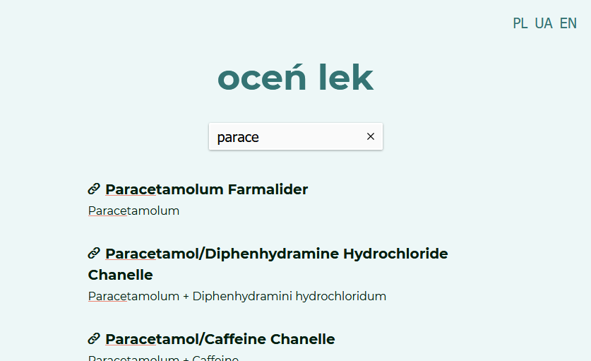

# ocen-lek

A simple app where you can find reviews for medications and add your own.

## Screenshots




## Technologies used

- JavaScript
- React
- Redux
- Sass
- HTML
- CSS
- Firebase
- Algolia

other packages:

- React Router
- i18next
- moment.js
- react-content-loader
- react-js-pagination
- React Rating

## Features

1. Searching medicine by name or active substance
2. Product page:
   - basic info
   - reviews
   - add review

## Setup

After cloning the repo:

```
yarn
```

To start the app:

```
yarn start
```

This project uses Google's Firebase Firestore and Aloglia search engine so you'll need to provide a `.env` file with the following variables:

```
REACT_APP_FIREBASE_API_KEY=xxx
REACT_APP_FIREBASE_AUTH_DOMAIN=xxx
REACT_APP_FIREBASE_PROJECT_ID=xxx
REACT_APP_ALGOLIA_APP_ID=xxx
REACT_APP_ALGOLIA_SEARCH_APP_ID=xxx
```
